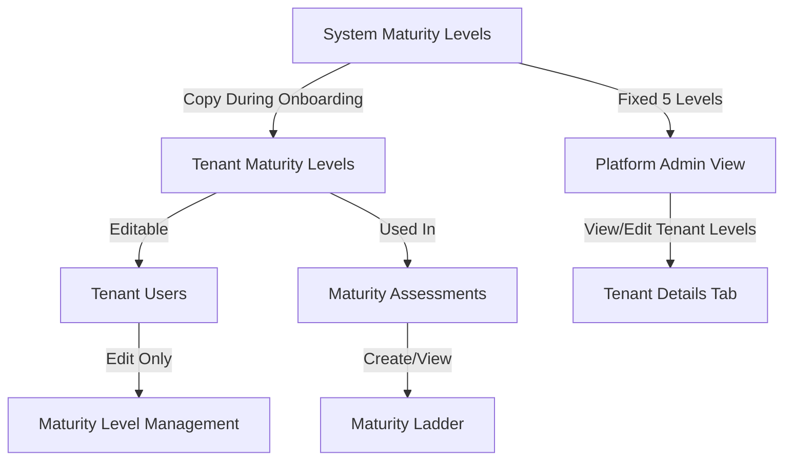

# System Maturity Levels with Tenant Copies Implementation Plan

## Overview

Transform the maturity levels architecture from global shared levels to:

- **System-defined levels**: 5 fixed, read-only levels managed by platform admin
- **Tenant-specific copies**: Editable copies created during onboarding (no create/delete)
- **Onboarding integration**: Copy levels after Step 2 (Add Team Members), then navigate to maturity ladder

## Architecture Changes

### Database Schema

**Migration: `014-add-tenant-to-maturity-levels.sql`**

- Add `tenant_id UUID` column (nullable, references tenants)
- Add `is_system BOOLEAN` column (default false)
- Mark existing 5 levels as system levels (`is_system = true`, `tenant_id = NULL`)
- Create unique constraints:
- System levels: `level` must be unique globally
- Tenant levels: `(tenant_id, level)` must be unique per tenant
- Add indexes for performance

### Data Flow




## Implementation Tasks

### 1. Database Migration

**File:** `coachqa-backend/migrations/014-add-tenant-to-maturity-levels.sql`

- Add `tenant_id` and `is_system` columns
- Update existing 5 levels to be system levels
- Create unique constraints and indexes
- Ensure backward compatibility

### 2. Backend Model Updates

**File:** `coachqa-backend/src/models/MaturityLevel.ts`

- Add `tenantId?: string | null` to `MaturityLevelAttributes`
- Add `isSystem: boolean` to `MaturityLevelAttributes`
- Update `MaturityLevel.init()` to include new columns
- Update field mappings for snake_case database columns

### 3. Backend Service Updates

**File:** `coachqa-backend/src/services/maturity.service.ts`**New Functions:**

- `getSystemMaturityLevels()` - Get all system-defined levels (for platform admin)
- `getTenantMaturityLevels(tenantId)` - Get tenant-specific levels
- `copySystemLevelsToTenant(tenantId)` - Copy all 5 system levels to tenant
- `getAllMaturityLevels(tenantId?)` - Get levels for tenant (tenant-specific if exist, else system)

**Modified Functions:**

- `updateMaturityLevel()` - Prevent editing system levels, ensure tenant can only edit their own
- `deleteMaturityLevel()` - Prevent deleting system levels, ensure tenant can only delete their own
- `createMaturityLevel()` - Restrict creation (only during onboarding copy process)

### 4. Backend Controller Updates

**File:** `coachqa-backend/src/controllers/maturity.controller.ts`**New Endpoints:**

- `getSystemMaturityLevels()` - GET `/api/maturity/levels/system` (platform admin only)
- `copySystemLevelsToTenant()` - POST `/api/maturity/levels/copy-to-tenant` (tenant context)
- `getTenantMaturityLevels()` - GET `/api/maturity/levels/tenant` (tenant context)
- `getTenantMaturityLevelsByTenantId(tenantId)` - GET `/api/platform-admin/tenants/:tenantId/maturity-levels` (platform admin, for Tenant Details tab)

**Modified Endpoints:**

- `getAllMaturityLevels()` - Use tenant context to return appropriate levels
- `updateMaturityLevel()` - Add validation for system vs tenant levels
- `deleteMaturityLevel()` - Add validation for system vs tenant levels

### 5. Backend Routes Updates

**File:** `coachqa-backend/src/routes/maturity.routes.ts`**

- Add route: `GET /levels/system` → `getSystemMaturityLevels`
- Add route: `POST /levels/copy-to-tenant` → `copySystemLevelsToTenant`
- Add route: `GET /levels/tenant` → `getTenantMaturityLevels`
- Update existing routes to handle tenant context

**Platform Admin Routes (in platform-admin routes):**

- Add route: `GET /tenants/:tenantId/maturity-levels` → Get tenant's maturity levels
- Add route: `POST /tenants/:tenantId/maturity-levels/copy` → Copy system levels to tenant

### 6. Onboarding Service Integration

**File:** `coachqa-backend/src/services/onboarding.service.ts`

- Add `copyMaturityLevelsForTenant(tenantId)` function
- Integrate with `updateOnboardingStep()` to automatically copy levels when Step 2 is completed
- Handle case where levels already exist (idempotent)

### 7. Frontend API Updates

**File:** `coachqa-ui/src/utils/api.ts`**New Functions:**

- `fetchSystemMaturityLevels()` - Get system levels (platform admin)
- `copySystemMaturityLevelsToTenant()` - Copy system levels to current tenant
- `copySystemMaturityLevelsToTenantById(tenantId)` - Copy system levels to specific tenant (platform admin)
- `fetchTenantMaturityLevels()` - Get tenant-specific levels (current tenant context)
- `fetchTenantMaturityLevelsByTenantId(tenantId)` - Get tenant-specific levels for specific tenant (platform admin)

**Updated Functions:**

- `fetchMaturityLevels()` - Should use tenant context (returns tenant levels if exist, else system)

### 8. Frontend: Platform Admin - Tenant Maturity Levels Management

**File:** `coachqa-ui/src/pages/platform-admin/TenantDetails.tsx`**Changes to Maturity Levels Tab (Tab 4):**

- Fetch tenant-specific levels for the selected tenant using `fetchTenantMaturityLevels(tenantId)` or API endpoint that accepts tenantId
- If tenant has no levels yet, show system levels as reference with option to copy
- Display tenant levels in editable table with edit functionality
- Edit functionality: name, description, criteria, color (level number read-only)
- No create button (levels must be copied from system first)
- No delete button (prevented by backend if assessments exist)
- Show info message explaining these are tenant-specific copies that can be customized
- Add "Copy from System" button if tenant has no levels yet

### 9. Frontend: Onboarding Integration

**File:** `coachqa-ui/src/components/onboarding/OnboardingWizard.tsx`**Modify Step 3 (currently "Explore Key Modules"):**

- After Step 2 completion, automatically copy system maturity levels
- Update step content to:
- Show "Configuring Maturity Levels" message
- Display loading state during copy
- Show success message when copied
- Add button to navigate to Maturity Ladder page
- Update `handleNext()` for step 2 to trigger level copying
- Handle errors gracefully

**Implementation Details:**

```typescript
// In handleNext() when activeStep === 2:
if (activeStep === 2) {
  // Copy maturity levels to tenant
  try {
    await copySystemMaturityLevelsToTenant();
  } catch (error) {
    // Handle error (may already exist)
  }
  // Navigate to user management
  navigate('/dashboard/users');
}
```


### 10. Frontend: Tenant Maturity Level Management

**File:** `coachqa-ui/src/pages/maturity-levels/MaturityLevelManagement.tsx` (create if doesn't exist)**Features:**

- Fetch tenant-specific levels using `fetchTenantMaturityLevels()`
- Display levels in editable table
- Edit functionality: name, description, criteria, color (level number read-only)
- No create button (levels are copied from system)
- No delete button (prevented by backend, but UI should not show)
- Show info message explaining these are tenant-specific copies

**Route:** `/dashboard/maturity-levels` (already exists in App.tsx)

### 11. Frontend: Maturity Ladder Updates

**File:** `coachqa-ui/src/pages/maturity-ladder/MaturityLadder.tsx`**Updates:**

- Ensure `fetchMaturityLevels()` returns tenant-specific levels if they exist
- No changes to assessment creation logic (uses level numbers)

## Key Constraints & Validations

### System Levels

- Cannot be edited (backend validation)
- Cannot be deleted (backend validation)
- Always 5 levels (1-5)
- `tenant_id = NULL`, `is_system = true`

### Tenant Levels

- Can be edited (name, description, criteria, color)
- Cannot change level number (immutable)
- Cannot create new levels (only via copy)
- Cannot delete levels (backend prevents if assessments exist)
- `tenant_id = <tenant_id>`, `is_system = false`
- Must have exactly 5 levels (copied from system)

### Onboarding Flow

- Levels are copied automatically after Step 2 completion
- Copy is idempotent (safe to call multiple times)
- If copy fails, show error but allow proceeding
- After copy, navigate to maturity ladder in Step 3

## Testing Considerations

1. **Migration Testing:**

- Verify existing 5 levels are marked as system
- Verify unique constraints work correctly
- Test with existing assessments

2. **Backend Testing:**

- System levels cannot be edited/deleted
- Tenant levels can be edited but not deleted if in use
- Copy operation creates exactly 5 levels
- Copy is idempotent

3. **Frontend Testing:**

- Platform admin can view and edit tenant-specific levels in Tenant Details tab
- Platform admin can copy system levels to tenant if tenant has no levels
- Tenant users see editable tenant levels
- Onboarding flow copies levels correctly
- Maturity ladder uses tenant-specific levels

## Migration Strategy

1. Run migration to add columns and mark existing levels as system
2. Existing tenants will continue using system levels until they complete onboarding
3. New tenants will get copies during onboarding
4. Existing assessments continue to work (reference by level number)

## Files to Modify

**Backend:**

- `coachqa-backend/migrations/014-add-tenant-to-maturity-levels.sql` (new)
- `coachqa-backend/src/models/MaturityLevel.ts`
- `coachqa-backend/src/services/maturity.service.ts`
- `coachqa-backend/src/services/onboarding.service.ts`
- `coachqa-backend/src/controllers/maturity.controller.ts`
- `coachqa-backend/src/routes/maturity.routes.ts`

**Frontend:**

- `coachqa-ui/src/utils/api.ts`
- `coachqa-ui/src/pages/platform-admin/TenantDetails.tsx`